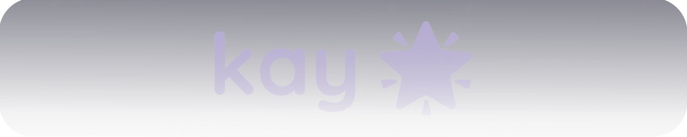

<h2>👋 Hi there! 👋</h2>

my name is **KayAurora** *(or Kay for short, but you can also call me Amethyst)*! ^^\
this is the place where I open-source my code. I currently mostly do web development but I'm planning to get into more soon!\
you might know me from **[@Axeon-Network](https://github.com/Axeon-Network)** and from other side projects I've worked on~

if you wanna reach out or just wanna know more about me, feel free to check out my website and/or other socials listed above!

